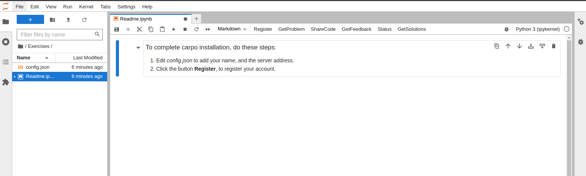

# How to log into CodingHub

Browse to this URL: http://141.225.10.101/hub/login

Your username is your_uom_username.

For example, if your UoM username is `jsmith@memphis.edu`, then your CodingHub username is **jsmith**.

The instructor will inform you of the default password.


# Setting up config.json file

You will need to replace "John Smith" with your name (FirstName LastName) in the default config.json file. To edit the config.json, right click and open with Editor.

```
{
    "name": "John Smith",
    "server": "http://delphinus.cs.memphis.edu:4151",
    "carpo_version": "0.0.8"
}
```
After edit, save the file (use Ctrl + S).

Now open `Readme.md` from the Left Sidebar. You'll see `Register` button on the toolbar. 



Click on `Register` to complete the setup. Once successful, you'll see a message dialoge box:
>**Student John Smith is registered as Student.**

You are all good to start coding exercises.