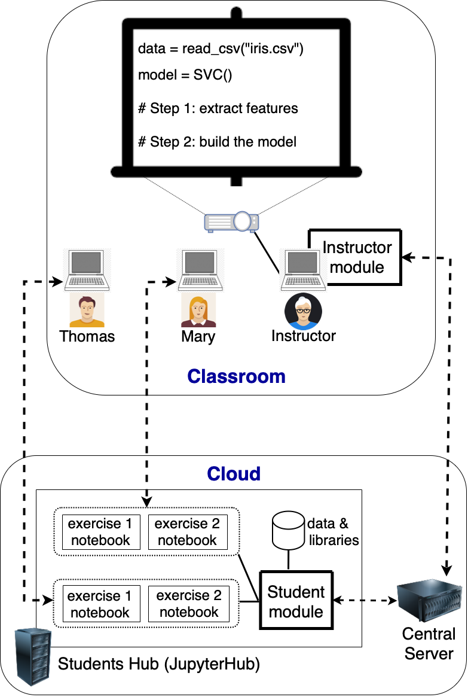

## Carpo
Carpo is a Jupyter-lab extension. It's designed to facilitate active learning in Data Science and Machine Learning courses. It is used within Jupyter notebooks to support in-class coding. 

In a nutshell, using carpo within Jupyter notebooks, students can share the code and teachers can look at students' shared code and provide feedback.

To use carpo, instructors, teaching assistants and students must first install JupyterLab (version 3.0 or later) on their computers.

## Overview 
There are two ways of using carpo for in-class coding.

1. Run carpo_server on a dedicated server. Teachers, TAs, students install appropriate JupyterLab extensions on their computers.

2. Run carpo_server on a dedicated server. Students can log into a coding hub to do in-class exercises. Teachers and TA install appropriate JupyterLab extension on their computers.

Installing JupyterLab extensions can be technically complicated.  We expect instructors and TAs to be able to go through this. However, it might be desirable for some students to use a coding hub without having to install the student extension.  Note that a student might both use a coding hub and separately install the extension on their own computer.  Setting up a coding hub, however, requires additional resources. Here's a [guideline](CodingHub/README.md).

## Setting up carpo_server

The server is written in Go.  You can either download the source and compile it on your Linux 
server.  Or you can download the binary executable.

Installation instructions can be found [here](carpo_server).

## Installation of Jupyter Lab extensions

### For students
Students can use the CodingHub without having to install the JupyterLab extension on their computers.  See [COMP4151](CodingHub/COMP4151.md), for example, on how to login to the CodingHub.

Alternately, students can install the extension on the own computers.
* [Student installation instructions](carpo_student/INSTALL.md)

### For teachers and TAs
Teachers and teaching assistants need to install the following extension on their computers.
* [Teacher installation instructions](carpo_teacher/README.md)
